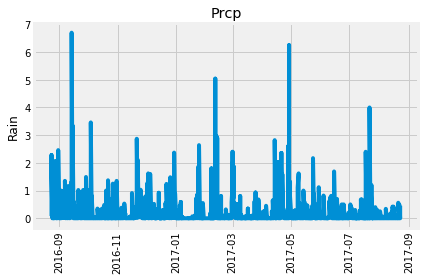
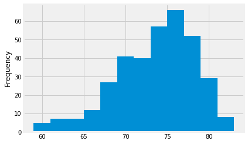
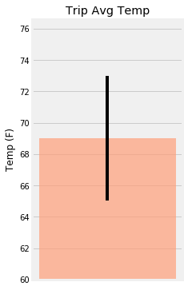

```python
%matplotlib notebook
from matplotlib import style
style.use('fivethirtyeight')
import matplotlib.pyplot as plt
%matplotlib inline
```


```python
import numpy as np
import pandas as pd
```


```python
import datetime as dt
```

# Reflect Tables into SQLAlchemy ORM


```python
# Python SQL toolkit and Object Relational Mapper
import sqlalchemy
from sqlalchemy.ext.automap import automap_base
from sqlalchemy.orm import Session
from sqlalchemy import create_engine, func

%ls
```

    Images/                    api/
    README.md                  climate_starter_MCM.ipynb
    Resources/                 hawaii.sqlite


```python
engine = create_engine("sqlite:///Resources/hawaii.sqlite")
```


```python
# reflect an existing database into a new model
Base = automap_base()
# reflect the tables
Base.prepare(engine, reflect=True)
```


```python
# We can view all of the classes that automap found
Base.classes.keys()
```


    ['measurement', 'station']


```python
# Save references to each table
Measurement = Base.classes.measurement
Station = Base.classes.station
```


```python
# Create our session (link) from Python to the DB
session = Session(engine)
```

# Exploratory Climate Analysis


```python
# Design a query to retrieve the last 12 months of precipitation data and plot the results

most_recent_date_query = session.query(Measurement).order_by(Measurement.date.desc()).limit(1)
    
for date in most_recent_date_query:
    most_recent_date = date.date

most_recent_date = dt.datetime.strptime(most_recent_date, "%Y-%m-%d")

# Calculate the date 1 year ago from today
one_year_ago = most_recent_date - dt.timedelta(days=365)

# Perform a query to retrieve the data and precipitation scores
recent_prcp_data = session.query(Measurement.date, Measurement.prcp).\
    filter(Measurement.date >= one_year_ago).\
    order_by(Measurement.date).all()

# Save the query results as a Pandas DataFrame and set the index to the date column
df = pd.DataFrame(recent_prcp_data).dropna()

df['date'] = pd.to_datetime(df['date'])

plt.plot(df['date'], df['prcp'])

plt.title("Prcp")
plt.xlabel('')
plt.ylabel('Rain')
plt.xticks(rotation='90')

plt.tight_layout()
#plt.show()
```





```python
# Use Pandas to calcualte the summary statistics for the precipitation data
df.describe()
```


<div>
<style scoped>
    .dataframe tbody tr th:only-of-type {
        vertical-align: middle;
    }

    .dataframe tbody tr th {
        vertical-align: top;
    }

    .dataframe thead th {
        text-align: right;
    }
</style>
<table border="1" class="dataframe">
  <thead>
    <tr style="text-align: right;">
      <th></th>
      <th>prcp</th>
    </tr>
  </thead>
  <tbody>
    <tr>
      <th>count</th>
      <td>2015.000000</td>
    </tr>
    <tr>
      <th>mean</th>
      <td>0.176462</td>
    </tr>
    <tr>
      <th>std</th>
      <td>0.460288</td>
    </tr>
    <tr>
      <th>min</th>
      <td>0.000000</td>
    </tr>
    <tr>
      <th>25%</th>
      <td>0.000000</td>
    </tr>
    <tr>
      <th>50%</th>
      <td>0.020000</td>
    </tr>
    <tr>
      <th>75%</th>
      <td>0.130000</td>
    </tr>
    <tr>
      <th>max</th>
      <td>6.700000</td>
    </tr>
  </tbody>
</table>
</div>


```python
# How many stations are available in this dataset?
 
session.query(Measurement.station).distinct().count()

```


    9


```python
# What are the most active stations?
# List the stations and the counts in descending order.

session.query(Measurement.station, func.count(Measurement.station).label('count')).\
                                  group_by(Measurement.station).\
                                  order_by('count DESC').all()
```

    /anaconda3/lib/python3.6/site-packages/sqlalchemy/sql/compiler.py:643: SAWarning: Can't resolve label reference 'count DESC'; converting to text() (this warning may be suppressed after 10 occurrences)
      util.ellipses_string(element.element))


    [('USC00519281', 2772),
     ('USC00519397', 2724),
     ('USC00513117', 2709),
     ('USC00519523', 2669),
     ('USC00516128', 2612),
     ('USC00514830', 2202),
     ('USC00511918', 1979),
     ('USC00517948', 1372),
     ('USC00518838', 511)]


```python

# Using the station id from the previous query, calculate the lowest temperature recorded, # Using  
# highest temperature recorded, and average temperature most active station?
most_active_station = session.query(Measurement.station, 
                                    func.count(Measurement.station).\
                                    label('count')).\
                                    group_by(Measurement.station).\
                                    order_by('count DESC').limit(1)[0][0]

sel = [func.min(Measurement.tobs),
       func.max(Measurement.tobs),
       func.avg(Measurement.tobs)]
                
session.query(*sel).filter(Measurement.station==most_active_station).all()
```

    /anaconda3/lib/python3.6/site-packages/sqlalchemy/sql/compiler.py:643: SAWarning: Can't resolve label reference 'count DESC'; converting to text() (this warning may be suppressed after 10 occurrences)
      util.ellipses_string(element.element))


    [(54.0, 85.0, 71.66378066378067)]


```python
# Choose the station with the highest number of temperature observations.
# Query the last 12 months of temperature observation data for this station and plot the results as a histogram
most_active_tobs = session.query(Measurement.tobs).\
                                filter(Measurement.station==most_active_station).\
                                filter(Measurement.date >= one_year_ago).\
                                order_by(Measurement.date.desc()).all()

x = [x[0] for x in most_active_tobs]
# bins = [x for x in range(12)]

plt.hist(x, bins=12)
plt.ylabel('Frequency')
#plt.show()
```


    Text(0,0.5,'Frequency')





```python
# Write a function called `calc_temps` that will accept start date and end date in the format '%Y-%m-%d' 
# and return the minimum, average, and maximum temperatures for that range of dates
def calc_temps(start_date, end_date):
    """TMIN, TAVG, and TMAX for a list of dates.
    
    Args:
        start_date (string): A date string in the format %Y-%m-%d
        end_date (string): A date string in the format %Y-%m-%d
        
    Returns:
        TMIN, TAVE, and TMAX
    """
    
    return session.query(func.min(Measurement.tobs), func.avg(Measurement.tobs), func.max(Measurement.tobs)).\
        filter(Measurement.date >= start_date).filter(Measurement.date <= end_date).all()
print(calc_temps('2012-02-28', '2012-03-05'))
```

    [(62.0, 69.57142857142857, 74.0)]


```python
# Use your previous function `calc_temps` to calculate the tmin, tavg, and tmax 
# for your trip using the previous year's data for those same dates.
temps = calc_temps('2015-02-16', '2015-03-15')
temps
```


    [(56.0, 68.98984771573605, 78.0)]


```python
# Plot the results from your previous query as a bar chart. 
# Use "Trip Avg Temp" as your Title
# Use the average temperature for the y value
# Use the peak-to-peak (tmax-tmin) value as the y error bar (yerr)

lower = temps[0][1] - temps[0][0]
upper = temps[0][2] - temps[0][1]

plt.figure(figsize=(3,6))
plt.bar(0, temps[0][1], yerr=[upper-lower], color='lightsalmon', alpha=0.7)
plt.title('Trip Avg Temp')
plt.xticks([])
plt.ylabel('Temp (F)')
plt.ylim(60)


```


    (60, 76.61802030456855)





```python
# Calculate the rainfall per weather station for your trip dates using the previous year's matching dates.
# Sort this in descending order by precipitation amount and list the station, name, latitude, longitude, and elevation

def collect_rainfall(start_date, end_date):
    return session.query(Measurement.station, 
                         Measurement.prcp.label('rainfall'),
                         Station.latitude,
                         Station.longitude,
                         Station.elevation).\
                            group_by(Measurement.station).\
                            join(Station, Measurement.station == Station.station).\
                            filter(Measurement.date >= start_date).\
                            filter(Measurement.date <= end_date).\
                            order_by('rainfall DESC').all()

collect_rainfall('2015-02-16', '2015-03-15')
```

    /anaconda3/lib/python3.6/site-packages/sqlalchemy/sql/compiler.py:643: SAWarning: Can't resolve label reference 'rainfall DESC'; converting to text() (this warning may be suppressed after 10 occurrences)
      util.ellipses_string(element.element))


    [('USC00514830', 0.13, 21.5213, -157.8374, 7.0),
     ('USC00511918', 0.0, 21.3152, -157.9992, 0.9),
     ('USC00513117', 0.0, 21.4234, -157.8015, 14.6),
     ('USC00516128', 0.0, 21.3331, -157.8025, 152.4),
     ('USC00517948', 0.0, 21.3934, -157.9751, 11.9),
     ('USC00519281', 0.0, 21.45167, -157.84888999999998, 32.9),
     ('USC00519397', 0.0, 21.2716, -157.8168, 3.0),
     ('USC00519523', 0.0, 21.33556, -157.71139, 19.5)]


